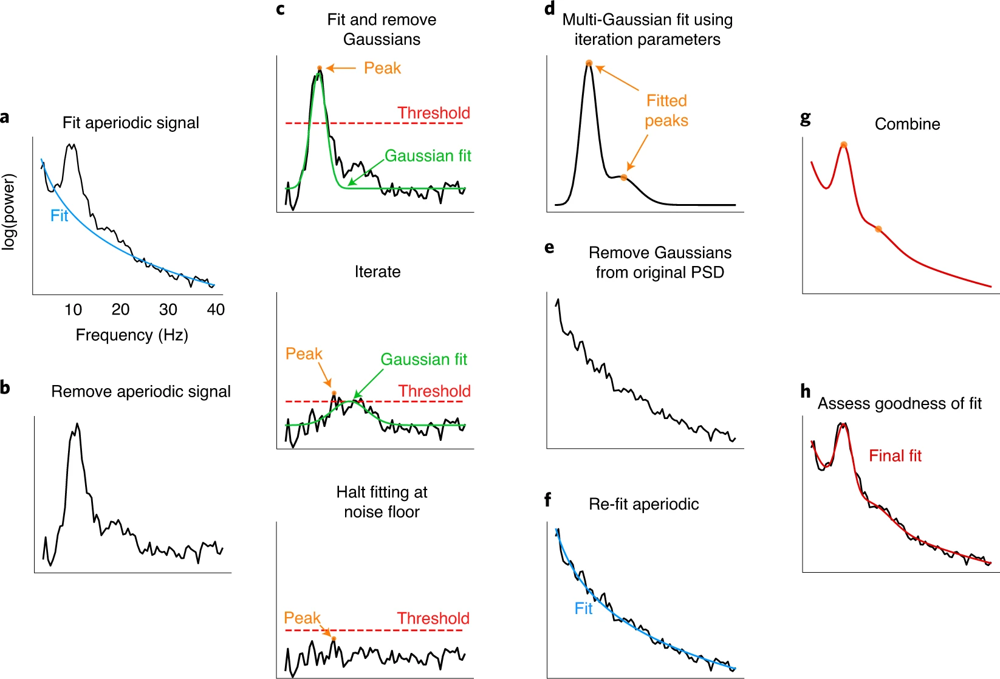
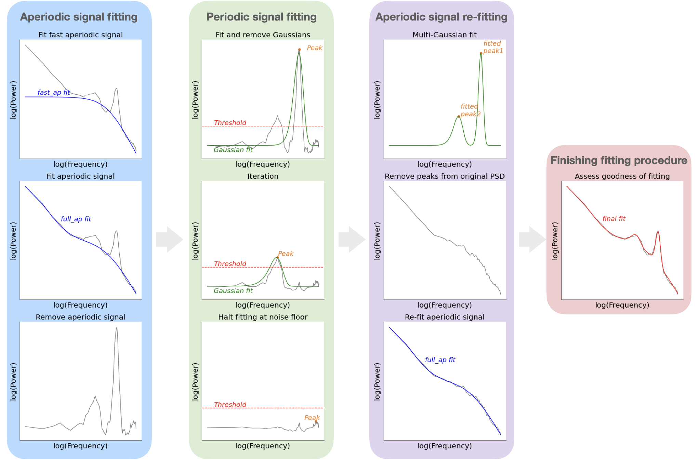

# visual_attention_lab_rotation

*** updates 0217

## Modification of FOOOF
### aperiodic model of original fooof
$$AP(F) = \frac{c}{knee+F_k^\chi}$$

### aperiodic model of modified fooof
$$AP(F) = c_1(\frac{c_2}{F^{\chi_2}+Fk^{\chi_2}}+\frac{1}{F^{\chi_1}+Fk^{\chi_1}})$$


## use the new model
- add fit_modified.py under fooof/objs/
- add 'from .fit_modified import FOOOF_new' in fooof/objs/__init__.py
- add 'from .objs import FOOOF_new' in fooof/__init__.py

- in your script
```
from fooof import FOOOF_new
```

